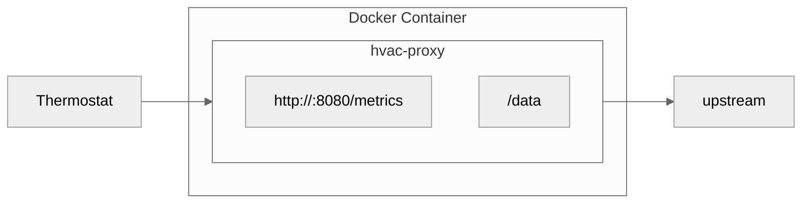

# HVAC Proxy

A lightweight HTTP proxy for Carrier/Bryant Infinity HVAC systems that logs XML traffic and exposes Prometheus-compatible metrics.

## Features

- 🔍 **Traffic Inspection** - Intercepts and logs all HTTP requests/responses between your thermostat and HVAC system
- 📊 **Prometheus Metrics** - Exposes temperature, humidity, fan speed, and system status as Prometheus gauges
- 💾 **XML Logging** - Saves prettified XML payloads to disk for analysis
- 🔄 **Transparent Proxy** - Forwards all traffic unmodified to maintain system functionality
- 🐳 **Docker Ready** - Minimal image size (~2MB) with multi-stage builds

### Architecture


## Supported Systems

Tested with:
- Bryant Evolution systems

Expected to work with:
- Carrier Infinity systems
- Systems using Proteus AC outdoor units
- Multi-zone systems with up to 8 zones

---

## User Guide

### Installation

#### Using Docker (Recommended)

```bash
# Pull from your registry
docker pull kwv4/hvac-proxy:latest

# Run the proxy
docker run -d \
  -p 8080:8080 \
  -v /var/log/hvac:/data \
  --name hvac-proxy \
  docker pull kwv4/hvac-proxy:latest
```

#### Building from Source

```bash
# Clone the repository
git clone https://github.com/kwv/hvac-proxy
cd hvac-proxy

# Initialize and build
go mod tidy
go build -o hvac-proxy

# Run
./hvac-proxy
```

### Setup

#### 1. Find Your Proxy IP Address

Your thermostat needs to connect to the machine running the proxy:

```bash
# On Linux
ip addr show | grep "inet " | grep -v 127.0.0.1

# On macOS
ifconfig | grep "inet " | grep -v 127.0.0.1

# Or check your router's DHCP client list
```

Look for an IP like `192.168.1.100` on your local network.

#### 2. Configure Your Thermostat

Point your HVAC thermostat to the proxy:
- **Host**: Your Docker host IP (e.g., `192.168.1.100`)
- **Port**: `8080`

The exact configuration method depends on your thermostat model. Consult your thermostat's network settings or API configuration.

#### 3. Verify It's Working

- View metrics: `http://YOUR_HOST_IP:8080/metrics`
- Check logs: `docker logs -f hvac-proxy`
- Verify XML files are being created in `/var/log/hvac/` (or your mounted volume)

### Using the Metrics

The `/metrics` endpoint exposes Prometheus-compatible gauges:

| Metric | Description | Unit |
|--------|-------------|------|
| `outdoorAirTemp` | Outdoor temperature | °F |
| `fanSpeed` | Fan speed | CFM |
| `filter` | Filter life remaining | % |
| `temperature` | Indoor temperature | °F |
| `relativeHumidity` | Indoor relative humidity | % |
| `heatSetPoint` | Heating setpoint | °F |
| `coolingSetPoint` | Cooling setpoint | °F |
| `localtime` | Last update timestamp | Unix time |

**Example output:**
```
# HELP outdoorAirTemp degrees in F
# TYPE outdoorAirTemp gauge
outdoorAirTemp 63.0
# HELP fanSpeed cubic feet minute
# TYPE fanSpeed gauge
fanSpeed 437
```

### XML Logging

All requests and responses are logged to `/data` (or your mounted volume path):

- `POST-status.xml` - Status updates from thermostat
- `GET-config-response.xml` - Configuration responses from upstream

XML files are automatically prettified with 2-space indentation. Only the latest file for each type is kept (files are overwritten on each request).

### Configuration

The proxy listens on port 8080 by default. To change this, set the `PORT` environment variable or modify `main.go`.

### Troubleshooting

#### Proxy not forwarding requests
- Check that the `Host` header is being passed correctly
- Verify network connectivity to the upstream HVAC system
- Ensure the thermostat can reach the proxy IP and port

#### Metrics showing zeros
- Ensure the thermostat is sending status updates
- Check your mounted volume (e.g., `/var/log/hvac/`) for saved XML files
- Verify the XML contains a `<status>` root element
- Check logs for parsing errors: `docker logs hvac-proxy`

#### Docker container not starting
- Verify port 8080 is not already in use: `netstat -tuln | grep 8080`
- Check container logs: `docker logs hvac-proxy`
- Ensure the volume mount path exists and is writable

#### Files not being saved
- Verify the volume mount in your Docker run command
- Check permissions on the host directory
- Look for error messages in the logs

### Log Output

The proxy logs all activity:

```
2025/11/15 18:52:45 hvac-proxy listening on :8080
2025/11/15 18:52:45 Saving XML files to /data/
[REQ] 192.168.1.100 → POST /status (1234 bytes)
[RESP] POST /status → 200 (elapsed: 45ms)
```

Files are saved silently without log messages for cleaner output.

---

## Developer Guide

### Prerequisites

- Go 1.22 or higher
- Docker (for containerization)
- Make (optional, but recommended)

### Quick Start

```bash
# Clone and setup
git clone <your-repo-url>
cd hvac-proxy
go mod tidy

# Run tests
make test

# Build and run locally
make run
```

### Project Structure

```
hvac-proxy/
├── main.go           # Main application code
├── main_test.go      # Test suite
├── Dockerfile        # Multi-stage Docker build
├── Makefile          # Build automation
├── go.mod            # Go module definition
├── go.sum            # Dependency checksums
├── README.md         # This file
└── LICENSE           # MIT License
```

### Development Workflow

#### Testing

```bash
# Run all tests
make test

# Run tests with coverage
make test-coverage

# Generate HTML coverage report
make coverage-report

# Run benchmarks
make bench

# Run specific test
go test -v -run TestMetricsHandler
```

#### Building

```bash
# Build binary
make build

# Run locally
make run

# Format code
make fmt

# Run linter (if golangci-lint is installed)
make lint

# Clean build artifacts
make clean
```

#### Docker Development

```bash
# Build Docker image
make docker-build

# Run container locally for testing
make docker-run

# View logs
make docker-logs

# Stop container
make docker-stop
```

#### Publishing

```bash
# Build and push to registry (auto-increments version)
make docker-push

# Or use the combined command
make docker-release
```

The version is automatically incremented and stored in `.version`. Both versioned and `latest` tags are pushed.

### Testing

The project includes comprehensive test coverage:

- **Unit Tests** - Test individual functions (XML parsing, metrics, etc.)
- **Handler Tests** - Test HTTP handlers with mock requests
- **Integration Tests** - End-to-end tests with mock upstream servers
- **Benchmark Tests** - Performance testing for critical paths

Run `make test-coverage` to see current coverage statistics.


**Key Components:**

1. **Proxy Handler** - Intercepts, logs, and forwards HTTP traffic
2. **Metrics Handler** - Exposes Prometheus-compatible metrics endpoint
3. **XML Parser** - Extracts HVAC status from XML payloads
4. **File Writer** - Saves prettified XML to disk

### Code Style

- Follow standard Go conventions
- Run `make fmt` before committing
- Use meaningful variable names
- Add comments for exported functions
- Keep functions focused and testable

### Contributing

1. Fork the repository
2. Create a feature branch (`git checkout -b feature/amazing-feature`)
3. Make your changes
4. Run tests (`make test`)
5. Commit your changes (`git commit -m 'Add amazing feature'`)
6. Push to the branch (`git push origin feature/amazing-feature`)
7. Open a Pull Request

### Making Changes

When modifying the code:

1. Update tests to cover new functionality
2. Run `make test-coverage` to ensure coverage remains high
3. Update this README if user-facing behavior changes
4. Use `make docker-release` to publish new versions

### Makefile Reference

Run `make help` to see all available commands:

```bash
make build           # Build the binary
make run             # Build and run
make test            # Run tests
make test-coverage   # Tests with coverage
make coverage-report # HTML coverage report
make bench           # Run benchmarks
make fmt             # Format code
make lint            # Run linter
make tidy            # Tidy dependencies
make clean           # Remove artifacts
make docker-build    # Build Docker image
make docker-push     # Build and push (auto-version)
make docker-release  # Build + push
make docker-run      # Run locally
make docker-stop     # Stop container
make docker-logs     # View logs
make help            # Show all commands
```

---

## License

MIT License - see [LICENSE](LICENSE) file for details.

## Acknowledgments

- Built with Go's standard library
- XML formatting using Go's `encoding/xml`
- Prometheus metrics format compatible
- Docker multi-stage builds for minimal image size
- Developed with assistance from Claude (Anthropic)

## Support

For issues, questions, or contributions, please open an issue on the repository.


