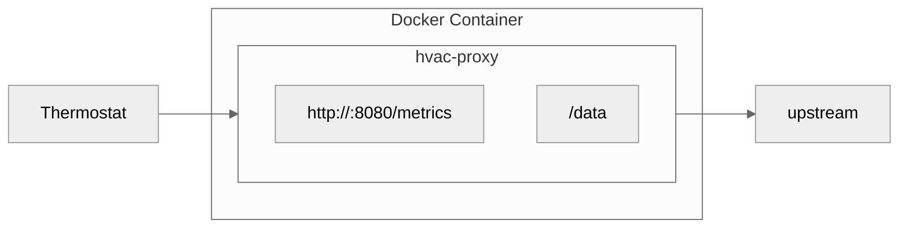

# HVAC Proxy

A lightweight HTTP proxy for Carrier/Bryant Infinity HVAC systems that logs XML traffic and exposes Prometheus-compatible metrics.

## Features

- 🔍 **Traffic Inspection** - Intercepts and logs all HTTP requests/responses between your thermostat and HVAC system
- 📊 **Prometheus Metrics** - Exposes temperature, humidity, fan speed, and system status as Prometheus gauges
- 💾 **XML Logging** - Saves prettified XML payloads to disk for analysis
- 🔄 **Transparent Proxy** - Forwards all traffic unmodified to maintain system functionality
- 🐳 **Docker Ready** - Minimal image size (~2MB) with multi-stage builds

### Architecture


## Supported Systems

Tested with:
- Bryant Evolution systems

Expected to work with:
- Carrier Infinity systems
- Systems using Proteus AC outdoor units
- Multi-zone systems with up to 8 zones

---

## User Guide

### Installation

#### Using Docker (Recommended)

```bash
# Pull from your registry
docker pull kwv4/hvac-proxy:latest

# Run the proxy (with optional BLOCK_UPDATES environment variable to block updates)
docker run -d \
  -p 8080:8080 \
  -v /var/log/hvac:/data \
  -e BLOCK_UPDATES="true" \ 
  --name hvacproxy \
  kwv4/hvac-proxy:latest
```

#### Building from Source

```bash
# Clone the repository
git clone https://github.com/kwv/hvac-proxy
cd hvac-proxy

# Initialize and build
go mod tidy
go build -o hvac-proxy

# Run
./hvac-proxy
```

### Setup

#### 1. Find Your Proxy IP Address

Your thermostat needs to connect to the machine running the proxy:

```bash
# On Linux
ip addr show | grep "inet " | grep -v 127.0.0.1

# On macOS
ifconfig | grep "inet " | grep -v 127.0.0.1

# Or check your router's DHCP client list
```

Look for an IP like `192.168.1.100` on your local network.

#### 2. Configure Your Thermostat

Point your HVAC thermostat to the proxy:
- **Host**: Your Docker host IP (e.g., `192.168.1.100`)
- **Port**: `8080`

The exact configuration method depends on your thermostat model. Consult your thermostat's network settings or API configuration.

#### 3. Verify It's Working

- View metrics: `http://YOUR_HOST_IP:8080/metrics`
- Check logs: `docker logs -f hvacproxy`
- Verify XML files are being created in `/var/log/hvac/` (or your mounted volume)

### Using the Metrics

The `/metrics` endpoint exposes Prometheus-compatible gauges:

| Metric | Description | Unit |
|--------|-------------|------|
| `outdoorAirTemp` | Outdoor temperature | °F |
| `fanSpeed` | Fan speed | CFM |
| `filter` | Filter life remaining | % |
| `temperature` | Indoor temperature | °F |
| `relativeHumidity` | Indoor relative humidity | % |
| `heatSetPoint` | Heating setpoint | °F |
| `coolingSetPoint` | Cooling setpoint | °F |
| `localtime` | Last update timestamp | Unix time |

**Example output:**
```
# HELP outdoorAirTemp degrees in F
# TYPE outdoorAirTemp gauge
outdoorAirTemp 63.0
# HELP fanSpeed cubic feet minute
# TYPE fanSpeed gauge
fanSpeed 437
```

### XML Logging

All requests and responses are logged to `/data` (or your mounted volume path):

- `POST-systems_SERIALNUMBER_status.xml` - Status updates from thermostat
- `GET-config-response.xml` - Configuration responses from upstream

XML files are automatically prettified with 2-space indentation. Only the latest file for each type is kept (files are overwritten on each request).

### Configuration

The proxy listens on port 8080 by default. To change this, set the `PORT` environment variable or modify `main.go`.


- `BLOCK_UPDATES`: If set to `"true"`, all `<update>` blocks in the XML response will be removed. This is useful for scenarios where updates should be conditionally blocked.

Example usage:

```bash
BLOCK_UPDATES="true" go run main.go
```

By default, the application will include all `<update>` blocks unless this variable is explicitly set.

### Troubleshooting

#### Proxy not forwarding requests
- Check that the `Host` header is being passed correctly
- Verify network connectivity to the upstream HVAC system
- Ensure the thermostat can reach the proxy IP and port

#### Metrics showing zeros
- Ensure the thermostat is sending status updates
- Check your mounted volume (e.g., `/var/log/hvac/`) for saved XML files
- Verify the XML contains a `<status>` root element
- Check logs for parsing errors: `docker logs hvacproxy`

#### Docker container not starting
- Verify port 8080 is not already in use: `netstat -tuln | grep 8080`
- Check container logs: `docker logs hvacproxy`
- Ensure the volume mount path exists and is writable

#### Files not being saved
- Verify the volume mount in your Docker run command
- Check permissions on the host directory
- Look for error messages in the logs

### Log Output

The proxy logs all activity:

```
2025/11/15 18:52:45 hvac-proxy listening on :8080
2025/11/15 18:52:45 Saving XML files to /data/
[REQ] 192.168.1.100 → POST /status (1234 bytes)
[RESP] POST /status → 200 (elapsed: 45ms)
```

Files are saved silently without log messages for cleaner output.


---

## License

MIT License - see [LICENSE](LICENSE) file for details.

## Acknowledgments

- Built with Go's standard library
- XML formatting using Go's `encoding/xml`
- Prometheus metrics format compatible
- Docker multi-stage builds for minimal image size
- Developed with assistance from Claude (Anthropic)

## Support

For issues, questions, or contributions, please open an issue on the repository.


